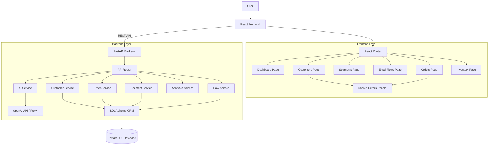

# Design Documentation

## High Level Design (HLD)

### Architecture Overview
The application follows a modern 3-tier architecture:
- **Frontend**: React.js Single Page Application (SPA) utilizing functional components, hooks, and React Router for navigation.
- **Backend**: FastAPI (Python) providing RESTful APIs.
- **Database**: PostgreSQL (SQLAlchemy ORM) for data persistence.

### Component Diagram

### Data Flow
1. **User Interaction**: User interacts with the React frontend.
2. **API Request**: Frontend makes async HTTP requests using the `api.js` service layer.
3. **Request Handling**: FastAPI router receives request, validates data using Pydantic models.
4. **Business Logic**: Service layer executes business rules (e.g., segment evaluation, tier calculation).
5. **Data Access**: SQLAlchemy translates operations to SQL queries.
6. **Response**: Data is returned to frontend and state is updated.

### Database Migration Strategy
The application uses **Alembic** for handling database schema migrations. This allows for:
- Version control of the database schema.
- Automatic generation of migration scripts from SQLAlchemy models.
- Safe upgrades and downgrades of the database structure.

---

## Low Level Design (LLD)

### Database Schema

### Frontend Component Architecture

#### reusable Components
- **`CustomerDetailsPanel`**: 
  - **Props**: `customerId`, `isOpen`, `onClose`, `onOrderClick`
  - **Functionality**: Fetches and displays customer profile, stats, tiers, and order history. 
  - **Key Feature**: Bi-directional navigation to Order Details.
- **`OrderDetailsPanel`**:
  - **Props**: `orderId`, `isOpen`, `onClose`, `onCustomerClick`
  - **Functionality**: Fetches and displays order summary, items, and shipping info.
  - **Key Feature**: Bi-directional navigation to Customer Details.
- **`StatusBadge`**: Visual indicator for order/customer status.
- **`Pagination`**: Handles table pagination logic.

#### Key Pages
- **`Customers.jsx`**:
  - State: `customers`, `search`, `filters`, `selectedCustomerId`, `selectedOrderId`
  - Features: Filtering, Searching, Editing, Viewing Details.
- **`Orders.jsx`**:
  - State: `orders`, `search`, `tabs`, `selectedOrderId`, `selectedCustomerId`
  - Features: Status Tabs, Order Lookup, Detail View.
- **`Segments.jsx`**:
  - Features: Rule builder for creating dynamic customer segments.
  - **AI Integration**: Natural language input via `AIInput` component in `Drawer`.
- **`Flows.jsx`**:
  - Features: Email sequence builder (Subject, Content, Delays).
  - **AI Integration**: Context-aware generation of full flow structure including segment selection.
- **`Dashboard.jsx`**:
  - Features: Real-time metrics visualization (Sales, AOV, Active Customers).
- **`Inventory.jsx`**:
  - Features: 
    - **CSV Export**: Download full product list for external analysis.
    - **Advanced Filtering**: Filter by Price Range and AI-Predicted Need via `Drawer`.
    - **Metrics**: Stock alerts and inventory valuation.

### Backend API Design

#### Customer Endpoints
- `GET /api/customers`: List customers with filtering/sorting.
- `GET /api/customers/{id}/details`: Get comprehensive customer view (Profile + Orders + Insights).
- `POST /api/customers`: Create new customer.
- `PUT /api/customers/{id}`: Update customer details.

#### Order Endpoints
- `GET /api/orders`: List orders with pagination.
- `GET /api/orders/{id}`: Get full order details.

#### Segment Endpoints

- `POST /api/segments/preview`: Preview customers matching specific rules (Dynamic Evaluation).
- `POST /api/segments/ai-generate`: Transform natural language to segment rules.

- `POST /api/segments/ai-generate`: Transform natural language to segment rules.

#### Inventory Endpoints
- `GET /api/inventory`: List products with pagination and advanced filtering (Price, Predicted Need).
- `GET /api/inventory/stats`: Get inventory overview metrics.
- `GET /api/inventory/{id}`: Get single product details.

#### Flow Endpoints
- `POST /api/flows/ai-generate`: Generate flow structure (Name, Steps, Segment) from prompt.

### AI Architecture
- **Service Layer**: `ai_service.py` handles LLM interactions.
- **Prompt Engineering**: Jinja2 (`segment_prompt.j2`) ensures consistent JSON output.
- **Resilience**:
  - **Type Coercion**: Numerics from LLM forced to strings for DB compatibility.
  - **Fallback**: Graceful error handling returns empty rule sets.

### Security Considerations
- **CORS**: Configured to allow frontend-backend communication.
- **Input Validation**: Pydantic models ensure semantic correctness of incoming data.
- **Error Handling**: Standardized HTTP error responses.
